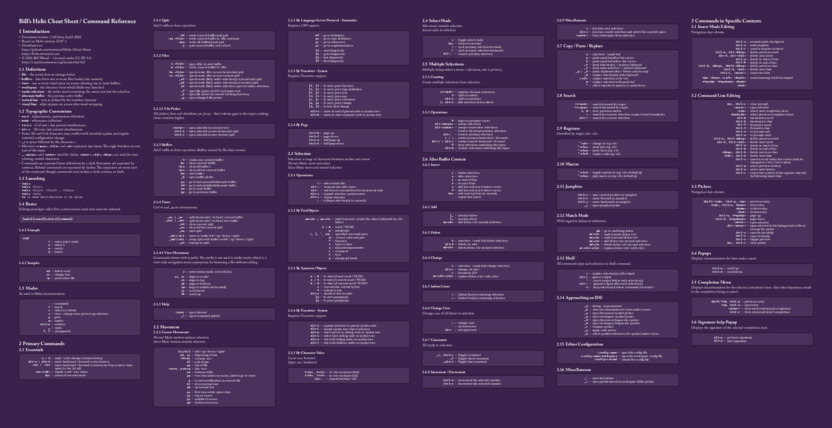

#  Bill's Helix Cheat Sheet / Command Reference
This started out as a simple cheat sheet but mushroomed into a
comprehensive command reference organized by function.  It is distributed in:

* us-letter and a4 sizes, portrait and landscape, and dark and light themes.
* 2x3-letter-sized poster, portrait and landscape, dark and light, single large page or print-ready on multiple us-letter sized pages to tape together.
* 1/4-letter-sized booklet, light and dark, print-ready on us-letter sized pages to cut, stack, and fold.
* a1 - a4, ansi-a - ansi-e, poster, us-legal, us-letter, landscape, dark, as samples of one-page auto-fit.

Light is best for printing unless you want to waste a lot of printer ink or toner. I like dark for reading on screen.

The layout dimensions were tweaked to align the non-auto-fit landscape poster horizontal split boundaries
with column gutters. This is not possible for the vertical split boundaries
and neither split boundaries of the portrait poster.

Download fixed sizes from the *dist* directory; auto-fit sizes from the *dist-auto-fit* directory.

Additionally, by building with a provided Python program or compiling the
cheat-sheet source with *Typst*, you can set it in:

* Any pagesize supported by *Typst*.
* An arbitrary size described by command-line options.

I'm keeping this as *beta* for the time being pending reports of errors in the content.



## Development Trajectory
A wise sage once said that the best way to learn something is to teach it. I find that preparing
cheat sheets is a great way to learn a new tool. It was in this spirit that I began
my work on this - just as a learning exercise - and from there it expanded to the present form,
which I believe is now worthy of sharing.

Initially I thought this would be a subset of the most common commands
from the full Helix command set, just enough for basic use.  I started with
the commands in the Helix *tutor* document but soon realized that was not
quite enough and so began adding *just a few* from the *keymap* page.  And
then my OCD *complete set* obsession (*collect them all*, from cereal
box prizes in my childhood) set in and I expanded it further to
all of the *keymap* and then *textobjects* pages and even a few
command-line items.

The *just enough for basic use* need will be addressed in a future *Quick Start* guide.

The principle difference between this and the Helix *keymap* and *textobjects* pages is the organization.
This is grouped by function instead of by modes, which are often grouped by the initial letter of a command instead
of by the function of the command.

As the cheat-sheet content stabilized I wanted to support any page size
without hand tuning.  I was specifically interested in automatically fitting the
cheat sheet onto an arbitrary target sheet size and page
count by iteratively adjusting the font size until the target is met.  This led
to support for any page size recognized by *Typst*.  A small sample of
several sizes from the absurdly unreadable small to huge is included.
I'm not going to provide set copy of all of the page sizes supported by
*Typst*, in both orientations and themes - think *Curse of
Dimensionality*. Instead, users should run *Build-Auto-Fit.py* or *Typst* directly to set
with their preferred parameters.

And I then became intrigued by the idea of a small, pocket-sized booklet. That led to the development
of the *booklet* size and software to impose the linear-sequence of pages into a printer spread
for printing eight pages per sheet, duplexed (front and back).

With an apology to non-US users, the *poster* and *booklet* sizes are based on us-letter sized sheets.
If us-letter paper is not available it is left as an exercise for the reader to tweak the source code
to your favorite paper width and height. 
See *std_width* and *std_height* constants near the top of the source.
I have no plans to expose them as command-line options.

**Editorial** -
I find the *booklet* format to be the most useful, more convenient that thumbing through
a bunch of letter-sized sheets, and far more convenient than getting up to look at a poster
on a wall. I suspect that is what I wanted all along - it just took a while to realize that.

## Why Another?
I like cheat sheets. Once the basic paradigm is understood they are a great way to learn
the the full scope of a tool without reading a volumes of documentation.

There are several Helix cheat sheets already available, the best is likely the one by Steve
Hoy.  Others cover only a small subset of commands and are set over too many
pages for quick reference.  While Steve's looks great when viewed on a screen, parts of it
are illegible when printed because of the shading, light type, and colors.  I wanted a
cheat sheet suitable for quick reference, that would print well, that would fit on a poster,
and in hindsight, in a booklet.

## Why Helix - A Personal Story
I have been using the *Rand Editor* since my first exposure with Unix, around 1980 -
Wollongong Unix running on Interdata / Perkin-Elmer hardware.  Since then I bought a release directly
from Rand, acquired another from CERN, found another online, and migrated to each
new computing environment I encountered.  Every attempt to convert to Vim, Emacs, VSCode,
etc. was thwarted by muscle memory or a distaste for GUI editors.  It was always just
easier to stick with Rand rather than try to learn something new.  Moreover, the Rand
editor has one feature - *quarter-plane editing model* - that, with the possible exception
of Emacs *picture mode*, no modern editor supports.  That, plus mode-less editing and
muscle memory kept me in the dark ages, editor-wise.

I had a lull in my development work In the winter of 2026 and so decided to finally invest the
time to learn a new editor. I might have been motivated by one of many limitations of Rand -
Unicode support, line length, IDE features, etc. - not sure at this point. My dear friend, ChatGPT, suggested that
the easiest migration path from Rand would be Kakoune or Helix. I settled on Helix because it is
pretty much complete out of the box.

### Mea Culpa
I must sheepishly admit that I did almost all of the development work on this with the *Rand Editor*. *Helix* is
great but I couldn't change over quickly enough.

## Links

* [Helix Home Page](https://helix-editor.com/)
* [Helix Documentation](https://helix-editor.com/)
* [Helix Keymap](https://docs.helix-editor.com/keymap.html)
* [Steve Hoy Cheat Sheet](https://github.com/stevenhoy/helix-cheat-sheet)
* [Hidden Monkey Cheat Sheet](https://cheatography.com/hiddenmonkey/cheat-sheets/helix/)
* [Kapeli Cheat Sheet](https://kapeli.com/cheat_sheets/Helix.docset/Contents/Resources/Documents/index)
* [RedOracle Cheat Sheet](https://redoracle.com/Documents/Tutorials/helixCheatSheet.html)
* [Rand Editor Manual](https://www.rand.org/pubs/notes/N2239-1.html)

## Rebuilding
The source for this is `Bills-Helix-Cheat-Sheet.typ`, which imports `Bills-Cheat-Sheet-Utils.typ`.
The following is applicable to *Linux*,
the environment in which it was developed.  It will likely be similar for
*MacOS* and a bit different for *Windows*.

### Requirements
You will need *typst* and *Adobe Caslon Pro*, *Roboto Mono*,
and *Zilla Slab* fonts to compile.  All fonts, font sizes, and page dimensions are
specified near the top of `Bills-Cheat-Sheet-Utils.typ` where they can be changed should your
opinion on appearance differs from mine. Additional requirements for building
with *make* are included below.

### Run Typst Directly

```
typst compile <options> Bills-Helix-Cheat-Sheet.typ <ofile>

<options>:                 
    --input pagesize=us-letter / a4 / poster / booklet / <any supported by typst>
    --input theme=light / dark
    --input orientation=portrait / landscape
    --input show-breaks=true / false            true: include page breaks before index and toc, set false for posters if including index or toc
    --input show-index=true / false             true: include index, usually false for posters
    --input show-toc=false / true               true: include table of contents, usually false
    --input col-width=60                        column width in em, used by Build-Poster.py for auto-fit
    --input font-scale=1.0                      scale for all fonts, used by Build-Poster.py for auto-fit
    --input fit=false / true                    also compute layout for us-letter, a4, poster, booklet
    --input width=0.0                           set custom page width, default use pagesize
    --input height=0.0                          set custom page height, default use pagesize
    --input mx=.5                               set custom page left & right margin, for custom page size
    --input my=.5                               set custom page top & bottom margin, for custom page size
    --input col_count=0                         set custom column count, for custom page size
    --input no-binding=false                    true: suppress alternating margin widths, not applicable to poster, booklet
    --input debug=false / true                  true: include layout information in Introduction
```
The pagesize of us-letter, a4, poster, and booklet are treated as special cases and use hand-tuned layout parameters.
Suppress this with *fit=false* to use computed layout as for all other sizes.

The poster size is based on six *us-letter* size pages.

|orientation| width | height | columns |
|---|---|---|---|
| portrait | 8.5 * 2 | 11 * 3 | 3 |
| landscape | 11 * 3 | 8.5 * 2 | 6 |

If width and height are both specified the values are used as a custom page size, the pagesize option is ignored,
and mx, my, and col_count options are used.

See *Makefile* for examples of running *typst* and option use.

The default option is the first following the equal sign.

### Split Poster Directly
In addition you will need *pdfposter*. Here are a couple of examples.
```
pdfposter -m 8.5x11in -p 17x33in Test-poster.pdf Test-poster-print.pdf     # portrait
pdfposter -m 11x8.5in -p 33x17in Test-poster.pdf Test-poster-print.pdf     # landscape
```

### Impose Booklet Directly
The *booklet-impose.py* program is included in the *src* folder.
It requires Python and the Python *pymupdf* (*python-pymupdf* in some distributions) package.
```
booklet-impose.py Test-booklet.pdf Test-booklet-print.pdf
```

### Build using Build-Auto-Fit.py
This is used in the Makefile for building the sample posters in the dist-auto-fit folder.
It can be run manually but is not particularly friendly with bogus options.

```
Build-Auto-Fit.py <options>

<options>
    --odir <odir> - send results to <odir>, default ../dist-auto-fit
    --poster <size> - build one poster of Typst supported pagesize <size>
    --multi <size> <count> - build one document of size <size> with <count> pages
    --sample-poster - build a sample of several different sizes posters
    --sample-multi - build a sample of us-letter size in several different page counts
    --show-sizes - show a list of all page sizes supported by Typst
```

### Build Using Makefile
In addition you will need *make*, and *fish*.

Build the complete suite include test suite and all distributions.
```
make all
```

Build test suite in *src* folder:
```
make tests
```

Build one test sample file in *src* folder:
```
make one
make a4
make booklet
make poster
```

Split test sample poster in *src* folder:
```
make split
```

Make standard distribution in *dist* folder:

```
make dist
```

Make sample auto-fit distribution in *dist-auto-fit* folder:

```
make dist-auto-fit
```

## Building the Booklet

Print the booklet on 8.5"x11" inch paper, duplexed (print on front and
back) on long edge, at 100% (don't scale to fit, it already includes adequate
margins).  If you don't have a duplex printer you will have to print odd
pages, put them back in printer (with proper orientation and inversion) and print even pages.  Cut in the exact middle
of the stack parallel to the short edge.  Place the bottom stack of cut
sheets on top of the top stack, fold, and staple.  I was unsuccessful
printing on Linux using Cups but got perfect results on Windows from the
PDF-XChange Viewer.  Cups buggered the margins and image scale.


## Contact
You can reach me via *Contact* at one of my other sites: [What!](https://what.wrwetzel.com) or through github.

# Release History
* 1.0.0, 15-Apr-2026 - Initial release, *us-letter*, *a4*, and locally-defined *poster* paper sizes.
* 1.1.0, 27-Apr-2026 - Added support for all paper sizes recognized by Typst; auto-fit build script to fit the
    full document on one sheet or specified number of sheets of any paper sizes; some refactoring of code;
    removed examples in lieu of separate future *Quick Start* document; added support for pocket-sized layout;
    minor wordsmithing in README.md and cheat-sheet content.

